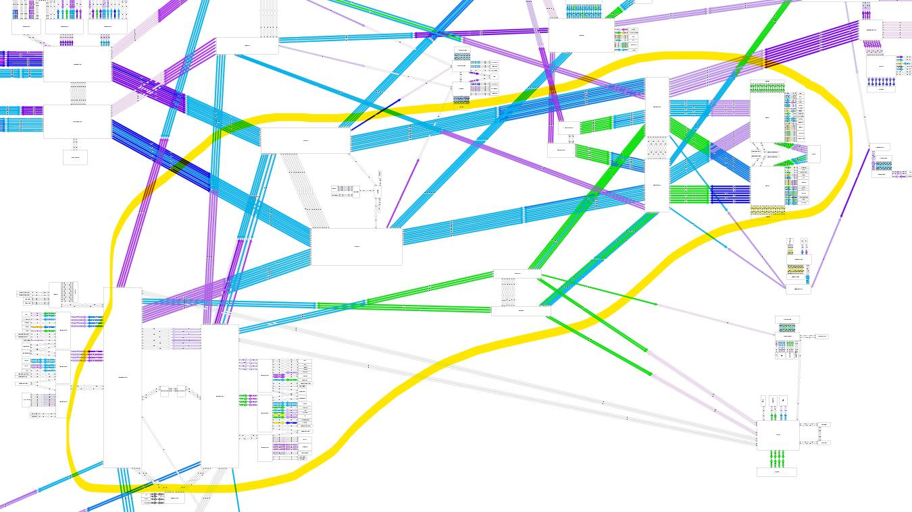
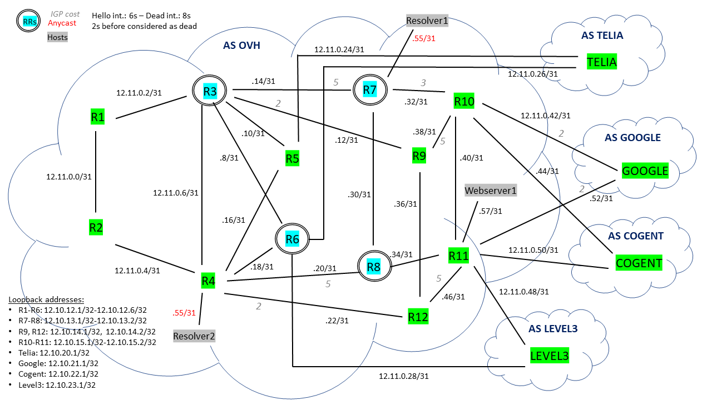

# OVH Network

This is a part of the "Computer Networks: Configuration and Management" course (LINGI2142, UCLouvain, academic year 2020-2021). The aim of this project is to develop a model of the OVH network (a large cloud provider based in France), configure it and manage it. 

## Initial Model

We have chosen a subpart of the OVH network as shown below (source: [OVH's Weathermap](http://weathermap.ovh.net/)):

We could represent it by the following model:

With some information (with IPv4 addressing plan):

Keep in mind this scheme, because it is the basis of our network configuration.

## How to launch the project

There are two files available in the *ovh_model*: *main.py* and *routers_cmd.py*. The first one permit to launch the OVH topology without the use of external commands from IPMininet and the second one allow us to use such commands. You will need *pexpect* (you can install it with *pip install pexpect*) to execute *routers_cmd.py*.

Our version of IPMininet is not modified, but we recommend installing the version included in this project to have the same version that us when we did the project.

If you want to test the security part of the project or if you want to see our eBGP announcements, you will need to use *routers_cmd.py*.

## Structure of this directory

There are some folders included in this current directory:

- `pcap`: You will find some `tcpdump` files used to test anycast DNS and to observe a reply from the server (even though the DNS requests which are sent are malformed, by sending them via `netcat`);
- `docs` contains some Markdown files about some aspects of the configuration of the network