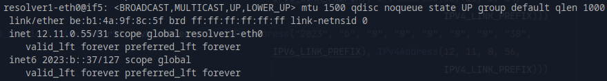
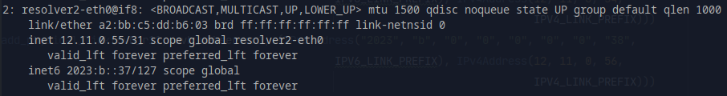
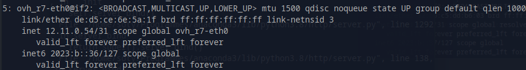
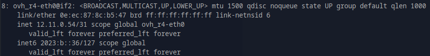
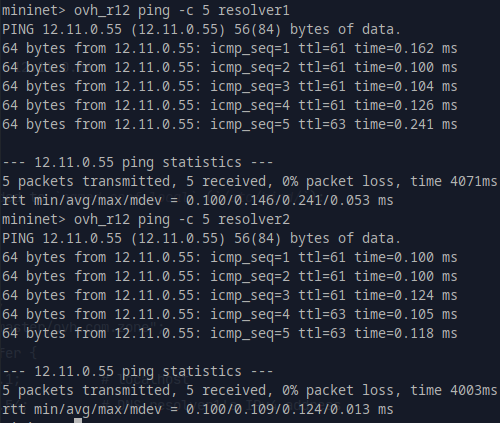
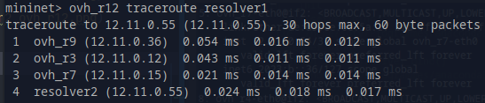
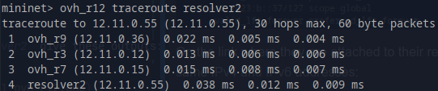

# Anycast DNS

In our network, we have:
- one web server attached to `ovh_r11`
- one DNS resolver attached to `ovh_r7` (`resolver1`)
- another DNS resolver attached to `ovh_r4` (`resolver2`)

`resolver1` and `resolver2` shares the same IPv4 and IPv6 addresses:




On the link where they are attached to their respective resolvers, `ovh_r7` and `ovh_r4` also share the same IPv4 and 
IPv6 addresses:




The DNS zone (`/tmp/named_resolver1.ovh.com.zone.cfg`) is configured as follows:

```
$TTL 172800
@       IN      SOA     ovh.com. sysadmin.ovh.com. (
1 ; serial
86400 ; refresh timer
7200 ; retry timer
3600000 ; retry timer
172800 ; minimum ttl
)

webserver1   120        IN      A       12.11.0.57
ovh.com.   60   IN      NS      resolver1.ovh.com.
ovh.com.   60   IN      NS      resolver2.ovh.com.
webserver1   60 IN      AAAA    2023:b::39
resolver1   60  IN      A       12.11.0.55
resolver1   60  IN      AAAA    2023:b::37
resolver2   60  IN      A       12.11.0.55
resolver2   60  IN      AAAA    2023:b::37
```

## Tests

### IPv4

- `ovh_r12` tries to reach `resolver1` and `resolver2`:



- `ovh_r12 traceroute resolver1` and `ovh_r12 traceroute resolver2` give these outputs:


(`resolver2` is indeed closer to `ovh_r12` than `resolver1`). 
Sometimes we have also this alternative route (corresponding to `resolver1`):




### IPv6

**ERROR**: `traceroute: 12.11.0.55: Address family for hostname not supported`
(when using `ping6` and `traceroute6`)

idem with: `sudo python3 -m ipmininet.examples --topo dns_network`, `sudo python3 -m ipmininet.examples --topo ipv6_segment_routing`

### UDP

We use the command `dig @server name type_record` to check if our anycast DNS works with UDP.

- `resolver1 dig @localhost ovh.com ANY`:
```
; <<>> DiG 9.11.3-1ubuntu1.12-Ubuntu <<>> @localhost -t ANY ovh.com
; (2 servers found)
;; global options: +cmd
;; Got answer:
;; ->>HEADER<<- opcode: QUERY, status: NOERROR, id: 62226
;; flags: qr aa rd ra; QUERY: 1, ANSWER: 3, AUTHORITY: 0, ADDITIONAL: 5

;; OPT PSEUDOSECTION:
; EDNS: version: 0, flags:; udp: 4096
; COOKIE: 120f6004bfdc53c472f5a68a5fa94f1d192806644b04d841 (good)
;; QUESTION SECTION:
;ovh.com.			IN	ANY

;; ANSWER SECTION:
ovh.com.		60	IN	NS	resolver1.ovh.com.
ovh.com.		60	IN	NS	resolver2.ovh.com.
ovh.com.		172800	IN	SOA	ovh.com. sysadmin.ovh.com. 1 86400 7200 3600000 172800

;; ADDITIONAL SECTION:
resolver1.ovh.com.	60	IN	AAAA	2023:b::37
resolver2.ovh.com.	60	IN	AAAA	2023:b::37
resolver1.ovh.com.	60	IN	A	12.11.0.55
resolver2.ovh.com.	60	IN	A	12.11.0.55

;; Query time: 0 msec
;; SERVER: ::1#53(::1)
;; WHEN: Mon Nov 09 14:15:57 UTC 2020
;; MSG SIZE  rcvd: 245
```

- `resolver1 dig @localhost webserver1.ovh.com AAAA`:

```
; <<>> DiG 9.11.3-1ubuntu1.12-Ubuntu <<>> @localhost webserver1.ovh.com AAAA
; (2 servers found)
;; global options: +cmd
;; Got answer:
;; ->>HEADER<<- opcode: QUERY, status: NOERROR, id: 40302
;; flags: qr aa rd ra; QUERY: 1, ANSWER: 1, AUTHORITY: 2, ADDITIONAL: 5

;; OPT PSEUDOSECTION:
; EDNS: version: 0, flags:; udp: 4096
; COOKIE: a130c1aa80b1347c8ea8fbf25fa95535df40b4ffd063006e (good)
;; QUESTION SECTION:
;webserver1.ovh.com.		IN	AAAA

;; ANSWER SECTION:
webserver1.ovh.com.	120	IN	AAAA	2023:b::39

;; AUTHORITY SECTION:
ovh.com.		60	IN	NS	resolver1.ovh.com.
ovh.com.		60	IN	NS	resolver2.ovh.com.

;; ADDITIONAL SECTION:
resolver1.ovh.com.	60	IN	AAAA	2023:b::37
resolver2.ovh.com.	60	IN	AAAA	2023:b::37
resolver1.ovh.com.	60	IN	A	12.11.0.55
resolver2.ovh.com.	60	IN	A	12.11.0.55

;; Query time: 0 msec
;; SERVER: ::1#53(::1)
;; WHEN: Mon Nov 09 14:41:57 UTC 2020
;; MSG SIZE  rcvd: 239
```

- **Unexpected result** with `resolver2 dig @localhost ovh.com ANY`:
```
; <<>> DiG 9.11.3-1ubuntu1.12-Ubuntu <<>> @localhost ovh.com ANY
; (2 servers found)
;; global options: +cmd
;; Got answer:
;; ->>HEADER<<- opcode: QUERY, status: SERVFAIL, id: 15695
;; flags: qr rd ra; QUERY: 1, ANSWER: 0, AUTHORITY: 0, ADDITIONAL: 1

;; OPT PSEUDOSECTION:
; EDNS: version: 0, flags:; udp: 4096
; COOKIE: 2000c13dee6bdaa35feaffaa5fa95692a7ffa9e455654b05 (good)
;; QUESTION SECTION:
;ovh.com.			IN	ANY

;; Query time: 0 msec
;; SERVER: ::1#53(::1)
;; WHEN: Mon Nov 09 14:47:46 UTC 2020
;; MSG SIZE  rcvd: 64

```

(with `nslookup` however, it does not work - idem for the example `sudo python3 -m ipmininet.examples --topo dns_network` -):

```
resolver1 nslookup ovh.com
Server:		127.0.0.1
Address:	127.0.0.1#53

*** Can't find ovh.com: No answer
```

- Send a UDP packet with `ovh_r1 sudo python3 udp_client.py` (or `ovh_r7 nc -u 12.11.0.55 53`) and capture it with 
`resolver1 tcpdump -i resolver1-eth0 udp port 53 -vv -x`, but no results:

```
On ovh_r7:
mininet> ovh_r7 sudo python3 udp_client.py
mininet> ovh_r7 nc -u 12.11.0.55 53

On resolver1:
mininet> resolver1 tcpdump -i resolver1-eth0 udp port 53 -vv -x
tcpdump: listening on resolver1-eth0, link-type EN10MB (Ethernet), capture size 262144 bytes
^C
0 packets captured
0 packets received by filter
0 packets dropped by kernel
```


```
>resolver1 fuser -v -n udp 53
                     USER        PID ACCESS COMMAND
53/udp:              root      24303 F.... named

>resolver1 sudo lsof -i -P -n
COMMAND   PID USER   FD   TYPE DEVICE SIZE/OFF NODE NAME
named   24303 root   21u  IPv6 343221      0t0  TCP *:53 (LISTEN)
named   24303 root   22u  IPv4 343225      0t0  TCP 127.0.0.1:53 (LISTEN)
named   24303 root   23u  IPv4 343227      0t0  TCP 12.11.0.55:53 (LISTEN)
named   24303 root  512u  IPv6 343220      0t0  UDP *:53 
named   24303 root  513u  IPv4 343224      0t0  UDP 127.0.0.1:53 
named   24303 root  514u  IPv4 343226      0t0  UDP 12.11.0.55:53 
```

### TCP

- We query name servers by using TCP with this command: `resolver1 dig @localhost ovh.com ANY +tcp` 
(or `resolver1 dig @localhost ovh.com ANY +vc`):

```
; <<>> DiG 9.11.3-1ubuntu1.12-Ubuntu <<>> @localhost -t ANY ovh.com +tcp
; (2 servers found)
;; global options: +cmd
;; Got answer:
;; ->>HEADER<<- opcode: QUERY, status: NOERROR, id: 41625
;; flags: qr aa rd ra; QUERY: 1, ANSWER: 3, AUTHORITY: 0, ADDITIONAL: 5

;; OPT PSEUDOSECTION:
; EDNS: version: 0, flags:; udp: 4096
; COOKIE: e6ba31c6ed567ec44470db025fa95018d8c6a46d80031390 (good)
;; QUESTION SECTION:
;ovh.com.			IN	ANY

;; ANSWER SECTION:
ovh.com.		60	IN	NS	resolver2.ovh.com.
ovh.com.		60	IN	NS	resolver1.ovh.com.
ovh.com.		172800	IN	SOA	ovh.com. sysadmin.ovh.com. 1 86400 7200 3600000 172800

;; ADDITIONAL SECTION:
resolver1.ovh.com.	60	IN	AAAA	2023:b::37
resolver2.ovh.com.	60	IN	AAAA	2023:b::37
resolver1.ovh.com.	60	IN	A	12.11.0.55
resolver2.ovh.com.	60	IN	A	12.11.0.55

;; Query time: 0 msec
;; SERVER: ::1#53(::1)
;; WHEN: Mon Nov 09 14:20:08 UTC 2020
;; MSG SIZE  rcvd: 245
```

- **Unexpected result** (same as using UDP with `resolver2`) with `resolver2 dig @localhost ovh.com ANY +tcp`

```
; <<>> DiG 9.11.3-1ubuntu1.12-Ubuntu <<>> @localhost ovh.com ANY +tcp
; (2 servers found)
;; global options: +cmd
;; Got answer:
;; ->>HEADER<<- opcode: QUERY, status: SERVFAIL, id: 53624
;; flags: qr rd ra; QUERY: 1, ANSWER: 0, AUTHORITY: 0, ADDITIONAL: 1

;; OPT PSEUDOSECTION:
; EDNS: version: 0, flags:; udp: 4096
; COOKIE: 9d1cebcd83e90852fa1f1f4c5fa959aef23c7aa81e13b4f6 (good)
;; QUESTION SECTION:
;ovh.com.			IN	ANY

;; Query time: 0 msec
;; SERVER: ::1#53(::1)
;; WHEN: Mon Nov 09 15:01:02 UTC 2020
;; MSG SIZE  rcvd: 64
```