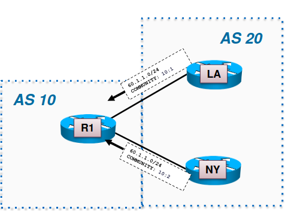

# FRRouting Commands

   - [Reminder: some IPMininet useful commands](#reminder-some-ipmininet-useful-commands)
   - [Connection to FRRouting daemons](#connection-to-frrouting-daemons)
   - [RIB](#rib)
   - [BGP](#bgp)
       - [Enabling BGP](#enabling-bgp)
       - [Configuring a Peer](#configuring-a-peer)
           - [eBGP Peering](#ebgp-peering)
           - [iBGP Peering](#ibgp-peering)
           - [Route Reflector](#route-reflector)
       - [BGP Path Selection Algorithm and Policies](#bgp-path-selection-algorithm-and-policies)
       - [Communities](#communities)
           - [Sending Communities](#sending-communities)
           - [Receiving Communities](#receiving-communities)
       - [Debugging Commands](#bgp-debugging-commands)
       - [Other Commands](#other-commands)
   - [OSPF](#ospf)
       - [Enabling OSPF](#enabling-ospf)
       - [Configuring OSPF Interface Parameters](#configuring-ospf-interface-parameters)
       - ["Hello" and "dead" Intervals](#hello-and-dead-intervals)
       - [OSPF Debugging Commands](#ospf-debugging-commands)
   - [References](#references)

---

## Reminder: some IPMininet useful commands

- `nodes`: displays nodes
- `links` or `net`: displays links
- `<NODE|SWITCH|CONTROLLER> cmd`: executes `cmd` on the specified node (e.g.: `ovh_r1 ifconfig -a`)
- `pingall`: tests reachability over IPv4 and IPv6
- `<NODE1> ping -c X <NODE2>`: tests connectivity between `NODE1` and `NODE2` (where `X` is an integer)
- `dump`: displays all information about the nodes

## Connection to FRRouting daemons

To access to the configuration of FRRouting (within the IPMininet CLI), you have to use `telnet` to connect to FRRouting daemons.

A different port is used to access to every routing daemon. This small table shows the port associated to its default daemon:

| Port     | State | Service | Comments                                             |
|----------|-------|---------|------------------------------------------------------|
| 2601/tcp | open  | zebra   | controls the Routing Information Base (RIB) of each daemon                      |
| 2605/tcp | open  | bgpd    | show information related to the configuration of BGP |
| 2606/tcp | open  | ospf6d  | same but for OSPFv3 (OSPF for IPv6)                  |

To use it, type the following command: `[noecho] <NODE> telnet localhost XXXX` where XXXX is either 2601, 2605 or 2606 (for example: `noecho ovh_r1 telnet localhost 2606`). A new CLI interface will be shown. Type `zebra` as password in order to have the FRRouting CLI.

The commands listed below assume that you are using FRRouting CLI.

## RIB

(Commands known via `<node> telnet localhost 2601`)

- `show ip route`: shows all the routes contained in the RIB

## BGP

(Commands known via `<node> telnet localhost 2605`)

### Enabling BGP

We can enable BGP on each router by the following steps:

- `enable`: enters in EXEC mode (e.g.: `ovh_r1#`)
- `configure terminal`: enters in global configuration mode
- `router bgp <AS_NBR>`: activates BGP on the router and set his AS number
- `network <SUBNET_IP/MASK>` (optional): chooses the network on which advertise BGP
- `end`: exits router configuration mode

### Configuring a Peer

**After the previous steps have been executed (`enable`, `configure terminal` and `router bgp <AS_NBR>`)**, we can configure a BGP peer by these list of steps.

#### eBGP Peering

We follow this example (coming from [Cisco's Deployment and Operation of BGP](https://www.ciscolive.com/c/dam/r/ciscolive/emea/docs/2015/pdf/TECRST-2310.pdf)) to show a eBGP peering configuration.

On R20:

- `bgp router-id <A.B.C.D.>`: configures manually the router identifier to `A.B.C.D.` (e.g. `bgp router-id 20.100.100.20`)
- `neighbor <NEIGHBOR_IP> remote-as <REMOTE_AS_NBR>`: defines the neighbor (peer) as a member of remote AS `REMOTE_AS_NBR` (e.g. `neighbor 5.20.40.40 remote-as 40`)
- `neighbor <NEIGHBOR_IP> send-community`: sends a community to `NEIGHBOR_IP` (e.g. `neighbor 5.20.40.40 send-community`)
- `end`: exits configuration mode

On Internet:

- `router-id <A.B.C.D.>`: gets the router of ID `A.B.C.D.` in AS `AS_NBR` (e.g. `router-id 40.100.100.40`)
- `neighbor <NEIGHBOR_IP> remote-as <REMOTE_AS_NBR>`: defines the neighbor (peer) as a member of remote AS `REMOTE_AS_NBR` (e.g. `neighbor 5.20.40.20 remote-as 20`)
- `address-family ipv4`: specifies the IPv4 unicast address family and enters in its configuration mode
- `send-community`: sends community
- `end`: exits configuration mode

#### iBGP Peering

We follow this example (coming from [Cisco's Deployment and Operation of BGP](https://www.ciscolive.com/c/dam/r/ciscolive/emea/docs/2015/pdf/TECRST-2310.pdf)) to show a iBGP peering configuration.

On R2:

- `bgp router-id <A.B.C.D.>`: configures manually the router identifier to `A.B.C.D.` (e.g. `bgp router-id 10.100.100.2`)
- `neighbor <NEIGHBOR_IP> remote-as <REMOTE_AS_NBR>`: defines the neighbor (peer) as a member of (remote) AS `REMOTE_AS_NBR` (e.g. `neighbor 10.100.100.3 remote-as 10`)
- `neighbor <NEIGHBOR_IP> update-source Loopback0`: sets the loopback addresss of the neighbor (the interface as to be set previously by : `interface Loopback0` and `ip address <LOOPBACK_IP> 255.255.255.255`) (e.g. `neighbor 10.100.100.3 update-source Loopback0`)
- `neighbor <NEIGHBOR_IP> next-hop-self`: defines the neighbor as the next-hop of the current router (e.g. `neighbor 10.100.100.3 next-hop-self`)

Same commands must be applied on R3:

- `bgp router-id 10.100.100.3`
- `neighbor 10.100.100.2 remote-as 10`
- `neighbor 10.100.100.2 update-source Loopback0`
- `neighbor 10.100.100.2 next-hop-self`

#### Route Reflector

To configure the router as BGP route reflector and configure the specified neighbor of `neighbor <NEIGHBOR_IP>` as its client, use the `route-reflector-client` command (use `no route-reflector-client` if it is not the case):

After `enable`, `configure terminal` and `router bgp <AS_NBR>`:

- `neighbor <NEIGHBOR_IP> remote-as <REMOTE_AS_NBR>`
- `address-family ipv4`
- `route-reflector-client`

### BGP Path Selection Algorithm and Policies

As reminder, here are some attributes which will be compared between different paths to select a best path in the BGP decision process:

1. Local Preference: local to an AS (higher is better)
2. AS-Path: shorter AS-PATH is better
3. MED: often a reflection of IGP metrics (lower is better)
4. eBGP vs. iBGP: prefer eBGP path over iBGP path
5. IGP cost to NEXTHOP: lower is better
6. lowest router ID
7. shortest CLUSTER_LIST

We have to create route maps if we would like to configure BGP decision process. After `enable` and `configure terminal`, type `route-map <MAP_NAME> [permit|deny] [sequence-nbr]` to enter in the route-map configuration mode. There, we could perform these tasks:

- `set ip next-hop <IP_ADDRESS>`: specifies where output packets (that pass a match clause of a route map) will be sent
- `set metric <X>`: sets a MED value (i.e. the metric value shown in the BGP table)
- `set local-preference <X>`: sets the local-pref on the link

**It is recommended to apply those policies towards communities**.

### Communities

A COMMUNITY is an attribute that stores a number. BGP communities are set via route-map and are not advertised by default.

#### Sending Communities

We follow this example (coming from [Cisco's Deployment and Operation of BGP](https://www.ciscolive.com/c/dam/r/ciscolive/emea/docs/2015/pdf/TECRST-2310.pdf)) to show a iBGP peering configuration.

After `enable`, `configure terminal` and `router bgp <AS_NBR>`..., we apply this on LA:

- `neighbor 10.1.1.2 remote-as 10`: defines the neighbor (peer) as a member of (remote) AS 10
- `neighbor 10.1.1.2 send-community`: sends a community to the specified IP address 10.1.1.2
- `neighbor 10.1.1.2 route-map TAG_MY_ROUTES out`: defines a route-map (which defines more precisely how to redistribute routes, ...) called `TAG_MY_ROUTES` to send communities (`out`)
- we call `ip bgp-community new-format` to trigger a X:Y notation for the community
- `route-map TAG_MY_ROUTES permit 10`: we allow `TAG_MY_ROUTES` for the sequence number (related to the AS number here) 10
- `set community 10:1`: sets the community with the 4-byte number triggered by `ip bgp-community new-format`

#### Receiving Communities

We follow this example (coming from [Cisco's Deployment and Operation of BGP](https://www.ciscolive.com/c/dam/r/ciscolive/emea/docs/2015/pdf/TECRST-2310.pdf)) to show a iBGP peering configuration.

After `enable`, `configure terminal` and `router bgp <AS_NBR>`..., we apply this on R1:

- `neighbor <IP_ADDRESS> description <NAME>`: associates a description `NAME` with a neighbor (e.g. `neighbor 20.1.1.1 description LA_PEER`, `neighbor 30.1.1.1 description NY_PEER`)
- `neighbor <IP_ADDRESS> route-map <NAME> in`: defines a route-map for ingoing community (e.g. `neighbor 20.1.1.1 route-map NY_OR_LA in`, `neighbor 30.1.1.1 route-map NY_OR_LA in`)
- `ip community-list standard <NAME> permit|deny <LIST>`: creates a named standard community list (e.g. `ip community-list standard VIA_LA permit 100:1`, `ip community-list standard VIA_NY permit 100:2`)
- `route-map <NAME> permit|deny <sequence_nbr>`: enters in the route-map configuration mode (e.g. `route-map NY_OR_LA permit 10`, `route-map NY_OR_LA permit 20`)
- `match community <NAME>`: matches a BGP community given by `NAME` (e.g. `match community VIA_LA`, `match community VIA_NY`).

Once a BGP community is matched, we can apply policies, such that local-pref and so on, which will influence BGP path selection algorithm and then type `exit`.

### BGP Debugging Commands

- `show ip bgp summary`: provides the total number of routes and paths
- `show ip bgp <IP_ADDRESS>`: shows BGP routing table entry for `IP_ADDR`
- `show bgp community-list`: shows the list of communities.
- `show bgp nexthop`: shows the BGP nexthop table.
- `show bgp summary`: outputs a summary of the status of the BGP sessions on the local router.

### Other Commands

(See [Cisco's IP Routing: BGP Configuration Guide](https://www.cisco.com/c/en/us/td/docs/ios-xml/ios/iproute_bgp/configuration/xe-16/irg-xe-16-book.html)).

- `neighbor <NEIGHBOR_IP> prefix-list <PREFIX_NAME> in`: sets the ingoing filter for the interface
- `neighbor <NEIGHBOR_IP> prefix-list <PREFIX_NAME> out`: sets the outgoing filter for the interface

## OSPF

(Commands known via `<node> telnet localhost 2606`)

### Enabling OSPF

We can enable OSPF on each router by the following steps:

- `enable`: enters in EXEC mode (e.g.: `ovh_r1#`)
- `configure terminal`: enters in global configuration mode
- `router ospf <PID>`: enables OSPF on the router under process ID `PID`
- `network <IP_ADDRESS WILDCARD_MASK> area <AREA_NBR>`: sets the interface (`IP_ADDRESS WILDCARD_MASK`) on which OSPF will run and his area number (`AREA_NBR`)
- `end`: exits router configuration mode

### Configuring OSPF Interface Parameters

After `enable` and `configure terminal`, **we have to specify the interface number (that we would like to configure) via `interface <X>`**. Then, we can configure these different parameters (once finished, type `end`):

- `ip address <IP_ADDRESS SUBNET_MASK>`: changes the IP address to `IP_ADDRESS SUBNET_MASK` on the selected interface
- `ip ospf cost <X>`: defines the cost `X` of the link connected at the selected interface
- `neighbor <NEIGHBOR_IP COST>`: defines a specific cost (`NEIGHBOR_IP COST`) to reach a given neighbor (otherwise, neighbors will assume the cost of the interface based on the `ip ospf cost` command)
- `bandwidth <X>` [warning: does not work on Mininet]: defines the bandwidth to `X` Kbps, which is used to influence route metric cost (cost is the inverse of bandwidth: higher bandwidth has lower cost)
- `ip ospf priority <X>`: changes the chances/priority of `X` from range 0 to 255 to be the OSPF designated router (who act as the main point of contact for the network segment)

If only `interface` is specified, then it shows the interfaces available on the router (where `lo` designates the loopback interface).

#### "Hello" and "Dead" Intervals

OSPF uses hello packets and two timers to check if a neighbor is still alive or not. One timer is the "hello timer" which defines the frequency at which we have to send the hello packet and the second is the "dead interval" wich defines how long we should wait for hello packets before we declare the neighbor dead. A router send hello packet to his neighbors to tell them he is still alive.

We can change the value of the two timers with the commands (after `enable`, `configure terminal` and `interface` commands!):

- `ip ospf hello-interval <X>` (where `X` is the interval in seconds)
- `ip ospf dead-interval <X>` (where `X` is the interval in seconds)

### OSPF Debugging Commands

- `show ip ospf`: general information about OSPF on the router
- `show ip ospf interface`: provides information about each of the router’s interfaces.
- `show ip ospf neighbor`: display OSPF-neighbor information on a per-interface basis
- `show ip ospf database`: information about the link state database
- `show ip ospf route`: shows the OSPF topology table
- `show ip ospf route summary`: gives a summary of the OSPF routes
- `show ip ospf spf tree`: ASCII representation of the shortest path tree
- `clear ip route <IP_ADDRESS|*>` [warning: does not work on Mininet]: clears particular route (given by `IP_ADDRESS`) or all routes from routing table
- `debug ip ospf packets` [warning: does not work on Mininet]: displays exchanged OSPF packets

## References

- [Cisco's Deployment and Operation of BGP](https://www.ciscolive.com/c/dam/r/ciscolive/emea/docs/2015/pdf/TECRST-2310.pdf)
- [Cisco's IP Routing: BGP Configuration Guide](https://www.cisco.com/c/en/us/td/docs/ios-xml/ios/iproute_bgp/configuration/xe-16/irg-xe-16-book.html)
- [Cisco's IP Routing: OSPF Configuration Guide](https://www.cisco.com/c/en/us/td/docs/ios-xml/ios/iproute_ospf/configuration/xe-16/iro-xe-16-book/iro-cfg.html)
- [OSPF Configuration Step by Step Guide](https://www.computernetworkingnotes.com/ccna-study-guide/ospf-configuration-step-by-step-guide.html)
- [FRRouting User Guide](http://docs.frrouting.org/en/stable-7.1/)
- [Exploring OSPFv3 routing with IPMininet](http://blog.computer-networking.info/ipmininet-ospfv3/)
- [Exploring BGP with IPMininet](http://blog.computer-networking.info/bgp-mininet/)
